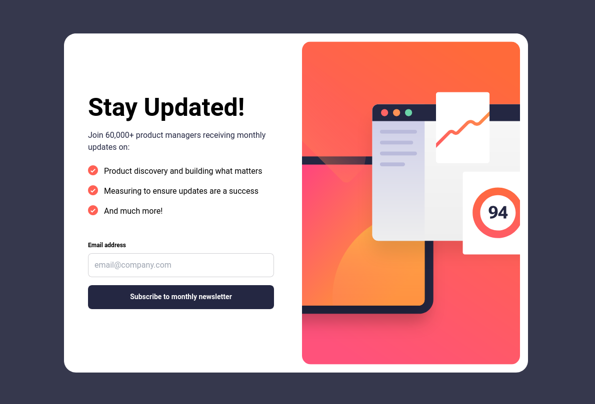

# Frontend Mentor - Newsletter sign-up form with success message solution

This is a solution to the [Newsletter sign-up form with success message challenge on Frontend Mentor](https://www.frontendmentor.io/challenges/newsletter-signup-form-with-success-message-3FC1AZbNrv). Frontend Mentor challenges help you improve your coding skills by building realistic projects.  

## Table of contents

- [Overview](#overview)
  - [The challenge](#the-challenge)
  - [Screenshot](#screenshot)
  - [Links](#links)
- [My process](#my-process)
  - [Built with](#built-with)
  - [What I learned](#what-i-learned)
  - [Continued development](#continued-development)
- [Author](#author)

## Overview

### The challenge

Users should be able to:

- Add their email and submit the form
- See a success message with their email after successfully submitting the form
- See form validation messages if:
  - The field is left empty
  - The email address is not formatted correctly
- View the optimal layout for the interface depending on their device's screen size
- See hover and focus states for all interactive elements on the page

### Screenshot

### Links

- Solution URL: [Here](https://github.com/jambanix/frontendmentor_newsletter_sign_up/settings/pages)
- Live Site URL: [Here](https://jambanix.github.io/frontendmentor_newsletter_sign_up/)

## My process

### Built with

- [React](https://reactjs.org/) - JS library
- [TailwindCSS](https://tailwindcss.com/) - TailwindCSS
- [react-hook-form](https://react-hook-form.com/) - react-hook-form

### What I learned

This challenge was good for bolstering understanding of working with TailwindCSS and CSS Grid

### Continued development

Keep doing more challenges alongside Udemy to gain more exposure to different concepts and problems to solve

## Author

- Frontend Mentor - [@jambanix](https://www.frontendmentor.io/profile/jambanix)
- Github - [jambanix](https://www.github.com/jambanix)
